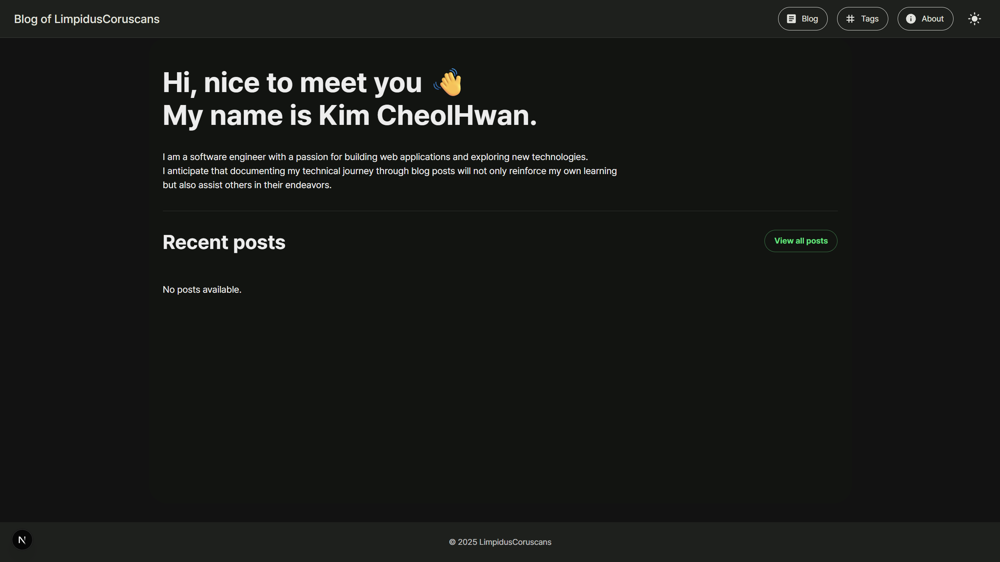

# Personal Tech Blog Built with Next.js


> A modern, responsive tech blog built with Next.js and Material You design principles.



## 🌟 Features

- **Markdown Content Management** - Write blog posts in Markdown/MDX for easy content creation
- **Responsive Material You Design** - Modern UI that adapts to different screen sizes
- **Dynamic Routing** - SEO-friendly URLs for blog posts
- **Dark/Light Mode** - Toggle between color themes
- **Syntax Highlighting** - Beautiful code blocks with copy functionality
- **Static Site Generation** - Fast loading speeds with pre-rendered pages
- **Tag System** - Categorize and filter blog posts by tags
- **Optimized Images** - Fast loading with Next.js Image component

## 🚀 Live Demo

Visit the live blog: [https://limpcoru.github.io](https://limpcoru.github.io)

## 💻 Tech Stack

- [Next.js](https://nextjs.org/) - React framework for static site generation
- [Material UI](https://mui.com/) - Component library with Material Design
- [Material You](https://m3.material.io/) - Dynamic color theming principles
- [gray-matter](https://github.com/jonschlinkert/gray-matter) - Markdown frontmatter parser
- [remark](https://github.com/remarkjs/remark) - Markdown processor
- [@mapbox/rehype-prism](https://github.com/mapbox/rehype-prism) - Syntax highlighting
- [date-fns](https://date-fns.org/) - Date formatting
- [Turbopack](https://turbo.build/) - Incremental bundler and build system

## 🏗️ Project Structure

```
/pages                           - Next.js pages and routing
  /_app.js                       - Global layout/theme
  /index.js                      - Homepage
  /blog/index.js                 - Blog list page
  /blog/[slug].js                - Individual blog page

/components                      - Reusable UI components
  Layout.js                      - Main layout with header and footer
  PostCard.js                    - Blog post card with Material UI styling
  CodeBlock.js                   - Enhanced code blocks with syntax highlighting

/lib                             - Utility functions and data processing
  posts.js                       - Markdown file processing logic
  tags.js                        - Tag management
  markdownToHtml.js              - Markdown conversion utilities

/content/posts                   - Markdown blog posts

/theme                           - Theme and Material You configuration
  M3.js                          - Material You implementation
  colorUtils.js                  - Color manipulation utilities

/styles                          - Global styles and CSS modules
/scripts                         - Utility scripts for build process
/public                          - Static files (images, icons, etc.)
```

> Full structure can be explored in the project root directory.

## 🌐 Deployment

This blog is configured for deployment on GitHub Pages:

1. Update `next.config.js` for static export:

```javascript
module.exports = {
  output: "export",
  images: {
    unoptimized: true,
  },
};
```

2. Add the GitHub Actions workflow in `.github/workflows/deploy.yml`
3. Push to your GitHub repository
4. Enable GitHub Pages in repository settings

## 🔮 Future Improvements

- [ ] Implement comments system
- [ ] Add view count statistics
- [ ] Refactor with TypeScript

## 📚 Learning Journey

This project represents my journey learning frontend development as a backend developer. Through building this blog, I gained experience with:

- React component architecture
- CSS styling and responsive design
- Static site generation and dynamic routing
- Client-side data fetching and state management
- DOM manipulation for enhancing code blocks

Feel free to explore the code to see my learning process!
